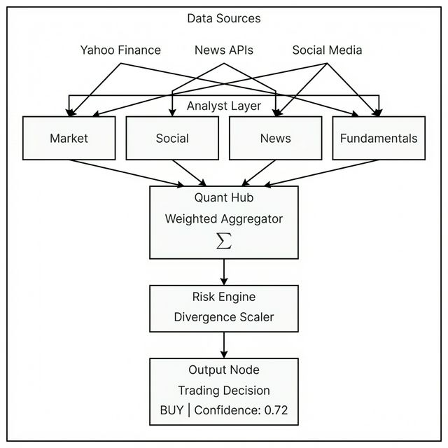

# QQ-AI-Quant-Lab (v5.2)

> **AI 驱动的量化财经智库** —— 集成实时新闻、社媒心理、基本面深度分析与 Kronos 时序预测。



## 🚀 架构革命：Algorithmic Decision Chain (V5.2)

QQ-AI-Quant-Lab 现已进化为**硬逻辑算法决策链**模式。我们摒弃了传统的 AI 模糊感性判断，引入了基于数学权重的聚合逻辑，确保每一项投资建议都具备极致的逻辑连贯性与可追溯性。

### 核心特性
- **Factor-Based Extraction (分析师层)**：所有分析师（市场、社媒、新闻、基本面）不再仅输出长篇宏论，而是通过 **标准化因子协议** 产出 `{decision, confidence, risk_score}`。
- **Weighted Aggregator (数字中枢)**：管理层通过预设权重对多方因子进行加权平均，计算出 **共识得分 (Consensus Score)**。
- **Risk Divergence Engine (风险判官)**：引入**分歧指数 (DI)** 计算。当全队分析出现严重分歧时，系统会自动压缩仓位并下修置信度。
- **Kronos Time-Series Integration**：深度整合 Kronos AI 时序预测，对静态逻辑进行动态时间轴校准。

## 🛠️ 安装与部署 (Requirements)

### 环境要求
- **Python**: `>= 3.11` (推荐使用 3.11+ 以获得最佳 f-string 兼容性)
- **操作系统**: Windows, Linux, macOS (已完成跨平台路径适配)

### 快速安装
```bash
# 克隆仓库
git clone <repository-url>
cd Dev_Workspace

# 安装依赖
pip install -e .
```

### 核心依赖清单 (Dependencies)
| 类别 | 关键库 | 用途 |
| :--- | :--- | :--- |
| **LangGraph** | `langchain`, `langgraph` | 构建多智能体决策图谱 |
| **Data** | `yfinance`, `duckduckgo-search` | 实时行情与全球资讯获取 |
| **Logic** | `numpy`, `pandas`, `stockstats` | 数值聚合与指标计算 |
| **UX** | `rich`, `questionary` | 沉浸式终端交互与格式化输出 |
| **ML/AI** | `torch`, `huggingface_hub` | Kronos 预测模型推理 |

## 🎮 启动指南

只需一条指令，即可进入全局智能体实验室：

```bash
lab-main
```

1. 在 TUI 菜单中选择 `🤖 智能体研究员`。
2. 输入股票代码（如 `AAPL`, `TSLA`）。
3. 观看 V5.2 决策链如何从原始信息自动推导出最终的 **量化决策建议**。

---
*Powered by Deepmind Advanced Agentic Coding Team*
